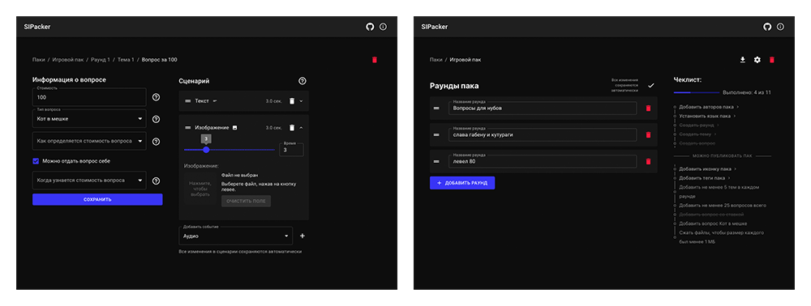

# SIPacker

An online pack editor for SIGame (Своя Игра / "Own Game") by Vladimir Khil.

<p align="center">
  
</p>

**Live version:** https://sipacker.netlify.app

## SIPacker vs other editors

[SIQuester](https://vladimirkhil.com/si/siquester) is the official pack editor for SIGame.

<!-- ✅ ❌ ⏳ -->

&nbsp;|SIPacker|SIQuester
---|---|---
Runs on macOS, Linux, Android<sup>1</sup>|✅|❌
Import packs by URL|✅|❌
Instant image compression|✅|❌
sigame.ru integration|⏳|❌
Works offline|✅|✅
Import and export .siq pack files|✅|✅
All question types supported|✅|✅
Text, audio, and video file support|✅|✅
External resource support|✅|✅
Export to HTML, XML, DOCX, RTF, XPS, plain text|❌|✅
Export for TV version / SNS submission|❌|✅
Pack merging|❌|✅
Single media file size limit|500 MB – 2 GB<sup>2</sup>|Images: 25 KB, audio: 500 KB
Total media storage limit|250 MB (up to 1 GB<sup>3</sup>)|Unlimited

<sup>1</sup> — The .NET runtime required to compile SIQuester can technically be installed on macOS and Linux, but there are no official build instructions and the UI may not work correctly on non-Windows systems.

<sup>2</sup> — Firefox: 800 MB, Chrome: 2 GB, Chrome (Android): RAM/5, Opera: 500 MB. It is recommended to keep individual files under 1 MB and the total pack size under 100 MB.

<sup>3</sup> — Users can manually increase the IndexedDB quota for a given origin in their browser settings.

## Running locally

### Prerequisites

- Node.js 18+
- npm 9+

### Development

```sh
npm install
npm run dev
```

The dev server starts at http://localhost:3000 with hot module replacement enabled.

### Production build

```sh
npm run build
```

Output is written to the `build/` directory. To preview the production build locally:

```sh
npm run preview
```

### Building with a URL base path

If the app is served from a subdirectory (e.g. GitHub Pages), set `VITE_BASE_PATH`:

```sh
VITE_BASE_PATH=/SIPacker npm run build
```

## Running with a fake domain and self-signed certificate

If you want to run SIPacker under a custom local domain with HTTPS (e.g. `https://sipacker.test`), follow the instructions in [/keys/Instructions.txt](/keys/Instructions.txt).